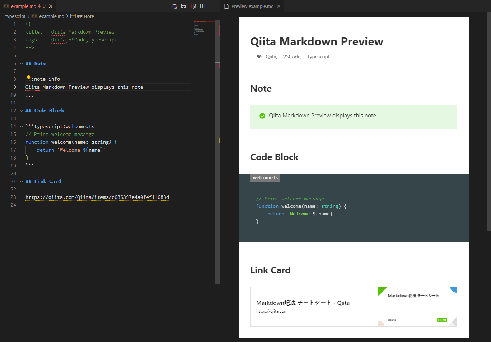

# Qiita Markdown Preview

VSCode extesion for build-in markdown preview to display Qiita Markdown syntax and style

## Features

Qiita Markdown syntax extensions are supported.

- Qiita Style
- Note
- Code Block (includes mathematical formulas)
- Link Card
- Title and Tags (for [Qiita-Sync](https://github.com/ryokat3/qiita-sync))

## Extension Settings

- `qiita-markdown-preview.status`: Enable/Disable Qiita Markdown Preview extension (default: 'null').
    The actual status is defined as the table below

    | User      | Workspace | Actual    |  
    |-----------|-----------|-----------|
    | enable    | eanble    | enalbe    |  
    | enable    | disable   | disable   |  
    | enable    | null      | enalbe    |  
    | disable   | eanble    | enalbe    |  
    | disable   | disable   | disable   |  
    | disable   | null      | disable   |   
    | null      | eanble    | enalbe    |  
    | null      | disable   | disable   |  
    | null      | null      | enable    | 

## Known Issues

- Refresh the markdown preview if some link cards are not displayed.

## Revision History

| Version  | Date       | Summary                                                           |
|----------|------------|-------------------------------------------------------------------|
| v0.2.0   | 2022-02-09 | CSS style enhanced, Configuration changed                         |
| v0.1.0   | 2022-02-06 | Automatic reload window on configuration change                   |
| v0.0.4   | 2022-02-05 | Updated documents                                                 |
| v0.0.3   | 2022-02-05 | First release                                                     |

-----------------------------------------------------------------------------------------------------------
### For more information

* [GitHub連携でQiita記事を素敵な執筆環境で！](https://qiita.com/ryokat3/items/d054b95f68810f70b136)
* [Visual Studio Code's Markdown Support](http://code.visualstudio.com/docs/languages/markdown)
* [Extension Guidelines](https://code.visualstudio.com/api/references/extension-guidelines)

